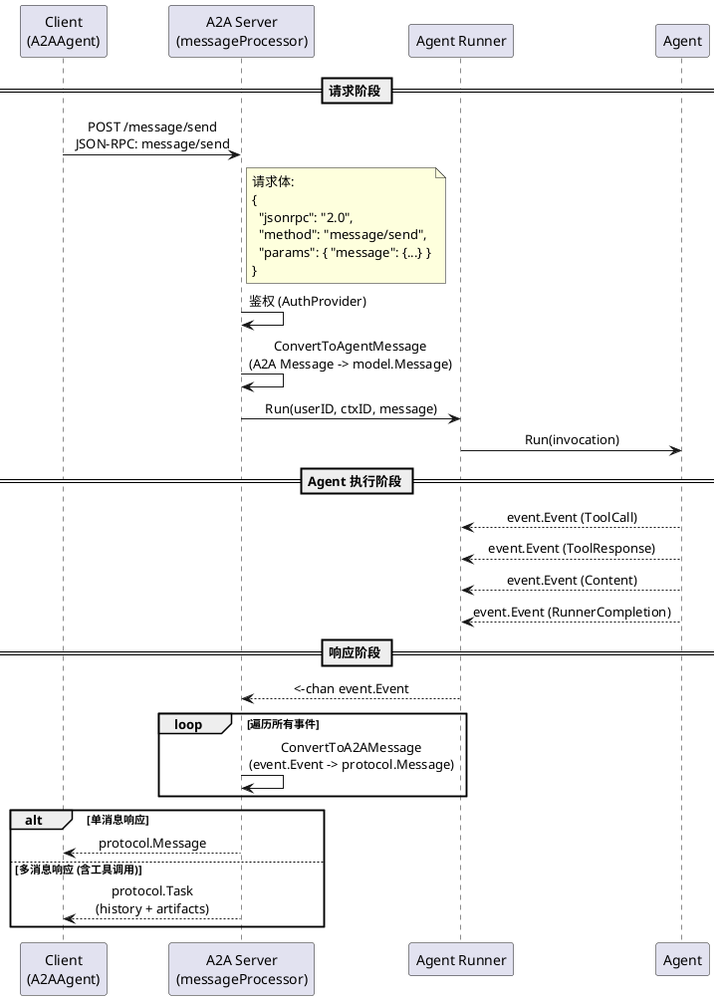
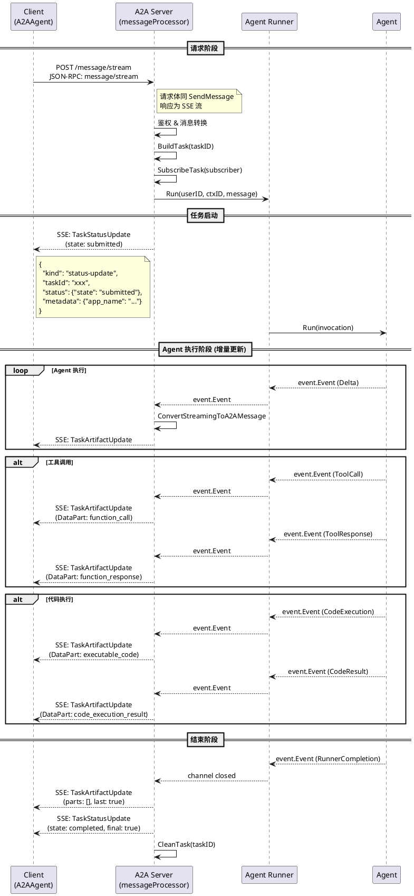
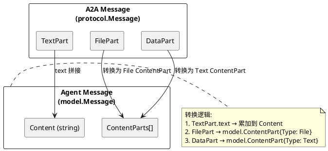
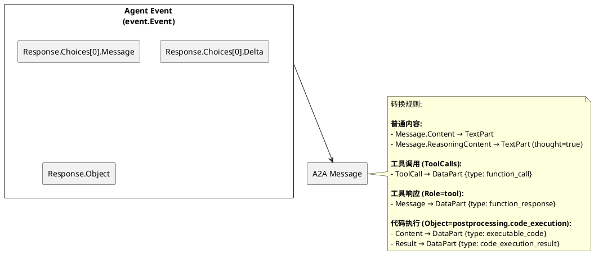
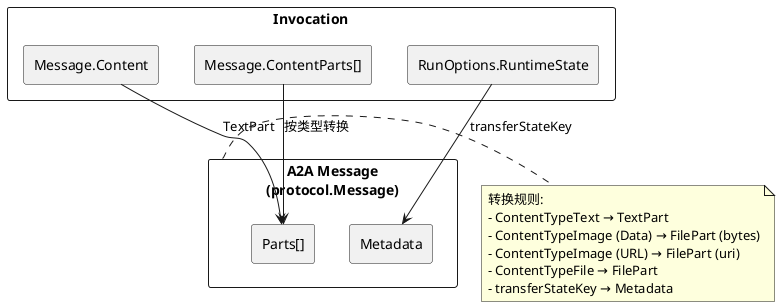

# A2A 协议交互规范

## 概述

本文档描述了基于 [A2A (Agent-to-Agent) 协议](https://a2a-protocol.org/latest/specification/) 的交互规范，**侧重于 Agent 对话场景**，支持同步和流式消息交互。

### 支持的特性


| 特性             | 状态    | 说明                       |
| ------------------ | --------- | ---------------------------- |
| `message/send`   | ✅ 支持 | 同步消息发送，等待完整响应 |
| `message/stream` | ✅ 支持 | 流式消息发送，增量接收响应 |
| Agent Card       | ✅ 支持 | Agent 能力发现             |
| 多模态内容       | ✅ 支持 | 文本、文件                 |
| 工具调用         | ✅ 支持 | Function Call / Response   |
| 代码执行         | ✅ 支持 | Code Execution             |
| 思考内容         | ✅ 支持 | Reasoning Content          |

### 暂不支持的特性

以下 A2A 协议特性本实现暂不支持，如有需要可后续扩展：


| 特性              | 说明                                      |
| ------------------- | ------------------------------------------- |
| Task 管理         | `tasks/get`、`tasks/list`、`tasks/cancel` |
| Push Notification | Webhook 异步回调通知                      |
| Task Subscribe    | 对已存在任务的独立订阅                    |
| 版本协商          | 协议版本自动协商                          |

> 完整的 A2A 协议规范请参考：https://a2a-protocol.org/latest/specification/

---

## 一、 协议数据结构定义 (JSON)

### 1.1 TextPart

```json
{
  "kind": "text",
  "text": "string",
  "metadata": {
    "thought": "boolean"
  }
}
```

### 1.2 FilePart

```json
{
  "kind": "file",
  "file": {
    "name": "string",
    "mimeType": "string",
    "bytes": "string (base64)",
    "uri": "string (url)"
  }
}
```

### 1.3 DataPart (以工具调用为例)

```json
{
  "kind": "data",
  "data": {
    "id": "string",
    "type": "string",
    "name": "string",
    "args": "string (json)",
    "response": "string"
  },
  "metadata": {
    "type": "function_call | function_response | executable_code | code_execution_result",
    "type": "function_call | function_response | executable_code | code_execution_result"
  }
}
```

### 1.4 Message (Unary Response)

```json
{
  "kind": "message",
  "messageId": "string",
  "role": "user | agent",
  "contextId": "string",
  "parts": ["PartObjects[]"],
  "metadata": {
    "object_type": "string"
  }
}
```

### 1.5 Task (Complex Unary Response)

```json
{
  "id": "string",
  "contextId": "string",
  "status": {
    "state": "submitted | completed | failed | canceled",
    "timestamp": "string (RFC3339)"
  },
  "history": ["MessageObjects[]"],
  "artifacts": [
    {
      "artifactId": "string",
      "parts": ["PartObjects[]"]
    }
  ],
  "metadata": "map"
}
```

### 1.6 Streaming Events

**Task Status Update:**

```json
{
  "kind": "status-update",
  "taskId": "string",
  "contextId": "string",
  "status": {
    "state": "submitted | completed | failed | canceled",
    "timestamp": "string"
  },
  "final": "boolean",
  "metadata": {
    "app_name": "string",
    "user_id": "string",
    "session_id": "string"
  }
}
```

**Task Artifact Update (Incremental):**

```json
{
  "kind": "artifact-update",
  "taskId": "string",
  "contextId": "string",
  "artifact": {
    "artifactId": "string",
    "parts": ["PartObjects[]"]
  },
  "last": "boolean",
  "metadata": {
    "object_type": "string"
  }
}
```

---

## 二、 核心交互逻辑与流程实现

### 2.1 交互时序图

#### 2.1.1 非流式交互 (Unary)



#### 2.1.2 流式交互 (Streaming)



### 2.2 核心逻辑实现说明

#### 2.2.1 非流式响应逻辑 (Unary Flow)

根据 `server/a2a/server.go` 实现，非流式响应根据消息数量有两种表现形式：

1. **单消息直接返回**：
   * 当 Agent 运行只产生一个有效事件（如直接回复文本）时，Server 直接返回 `protocol.Message` 对象。
2. **多消息 Task 封装**：
   * 当 Agent 运行产生多个事件（如：工具调用 -> 工具返回 -> 最终回复）时，Server 会将消息序列封装进 `protocol.Task`。
   * **History**: 包含除最后一条消息外的所有中间消息（如 `function_call` 和 `function_response`）。
   * **Artifacts**: 仅包含最后一条消息（最终结果）。
   * **Status**: 状态设为 `completed`。

#### 2.2.2 流式状态机实现 (Streaming Flow)

流式交互遵循严格的状态机序列：

1. **开始阶段 (Task Submitted)**：
   * 发送 `status-update` 事件，`state` 为 `submitted`。
   * 携带 `app_name`, `user_id`, `session_id` 等元数据。
2. **增量更新阶段 (Artifact Updates)**：
   * **普通文本**: 发送 `artifact-update`，包含增量文本内容。
   * **中间过程 (Tool/Code)**: 完整的工具调用或代码执行结果通过 `artifact-update` 下发，`last` 为 `false`。
3. **结束信号 (Final Artifact)**：
   * 发送一个 `parts` 为空的 `artifact-update`，且 `last` 标记为 `true`。
4. **完成阶段 (Task Completed)**：
   * 发送 `status-update` 事件，`state` 为 `completed`，且 `final` 标记为 `true`。

### 2.3 HTTP 协议细节

#### 2.3.1 请求格式 (JSON-RPC over HTTP)

A2A 协议基于 JSON-RPC 2.0，使用 HTTP POST 请求传输：


| 方法             | HTTP 端点                      | JSON-RPC Method  | Content-Type       |
| ------------------ | -------------------------------- | ------------------ | -------------------- |
| 发送消息 (Unary) | `POST /` 或 `POST /{basePath}` | `message/send`   | `application/json` |
| 流式消息         | `POST /` 或 `POST /{basePath}` | `message/stream` | `application/json` |
| 获取 AgentCard   | `GET /.well-known/agent.json`  | -                | -                  |

**请求示例 (SendMessage):**

```json
{
  "jsonrpc": "2.0",
  "id": "req-001",
  "method": "message/send",
  "params": {
    "message": {
      "messageId": "msg-001",
      "role": "user",
      "contextId": "ctx-001",
      "parts": [{ "kind": "text", "text": "Hello" }],
      "metadata": { "custom_key": "value" }
    }
  }
}
```

#### 2.3.2 响应格式

**Unary 成功响应:**

```json
{
  "jsonrpc": "2.0",
  "id": "req-001",
  "result": { /* protocol.Message 或 protocol.Task */ }
}
```

**Streaming 响应 (SSE):**

```
HTTP/1.1 200 OK
Content-Type: text/event-stream

event: message
data: {"kind":"status-update","taskId":"task-001",...}

event: message
data: {"kind":"artifact-update","taskId":"task-001",...}

event: message
data: {"kind":"status-update","taskId":"task-001","status":{"state":"completed"},"final":true}
```

#### 2.3.3 常用 HTTP Headers


| Header          | 方向           | 说明                                      |
| ----------------- | ---------------- | ------------------------------------------- |
| `X-User-ID`     | Request        | 用户标识，可通过`WithUserIDHeader` 自定义 |
| `Content-Type`  | Request        | `application/json`                        |
| `Content-Type`  | Response (SSE) | `text/event-stream`                       |
| `Authorization` | Request        | Bearer Token (可选)                       |

#### 2.3.4 鉴权与 UserID 获取

A2A 协议通过 HTTP Header 传递用户标识信息。

**UserID Header:**


| Header      | 默认值 | 说明                                 |
| ------------- | -------- | -------------------------------------- |
| `X-User-ID` | -      | 用户唯一标识，用于关联会话和权限控制 |

**UserID 获取规则:**

1. **优先使用 Header**: 如果请求携带了 `X-User-ID` Header，Server 使用该值作为用户标识
2. **自动生成**: 如果 Header 中未提供 UserID，Server 根据 `contextId` 自动生成：`A2A_USER_{contextId}`

**请求示例:**

```http
POST / HTTP/1.1
Host: agent.example.com
Content-Type: application/json
X-User-ID: user_12345

{
  "jsonrpc": "2.0",
  "id": "req-001",
  "method": "message/send",
  "params": {
    "message": {
      "messageId": "msg-001",
      "role": "user",
      "contextId": "ctx-001",
      "parts": [{ "kind": "text", "text": "Hello" }]
    }
  }
}
```

**自定义 UserID Header:**

Client 和 Server 可以协商使用自定义的 Header 名称来传递 UserID，双方需保持一致。

### 2.4 消息转换流程

#### 2.4.1 Server 端转换 (A2A → Agent)



#### 2.4.2 Server 端转换 (Event → A2A)



#### 2.4.3 Client 端转换 (Invocation → A2A)



---

## 三、 元数据字段说明 (Metadata)

### 3.1 Metadata 层级结构

A2A 协议中 Metadata 存在于两个层级，各层级承载不同类型的信息：

#### Message/Task 层级 Metadata

用于描述**整体消息或任务**的属性，主要包含事件来源、类型和追踪信息。


| 结构                          | 字段            | 类型   | 说明                                                                 |
| ------------------------------- | ----------------- | -------- | ---------------------------------------------------------------------- |
| `Message.Metadata`            | `object_type`   | string | 事件的业务类型，标识消息来源（如`chat.completion`、`tool.response`） |
|                               | `trace_id`      | string | 分布式追踪 ID，用于跨服务链路追踪                                    |
|                               | `invocation_id` | string | 调用 ID，标识单次 Agent 调用                                         |
| `TaskStatusUpdate.Metadata`   | `app_name`      | string | 应用/Agent 名称                                                      |
|                               | `user_id`       | string | 用户标识                                                             |
|                               | `session_id`    | string | 会话标识                                                             |
|                               | `trace_id`      | string | 分布式追踪 ID                                                        |
|                               | `invocation_id` | string | 调用 ID                                                              |
| `TaskArtifactUpdate.Metadata` | `object_type`   | string | 事件的业务类型                                                       |
|                               | `trace_id`      | string | 分布式追踪 ID                                                        |
|                               | `invocation_id` | string | 调用 ID                                                              |

**追踪字段说明：**

- `trace_id`：用于分布式追踪，可与 OpenTelemetry 等追踪系统集成，跨多个服务追踪一次完整的请求链路
- `invocation_id`：标识单次 Agent 调用，同一次调用产生的所有事件共享相同的 `invocation_id`

**示例 - Message.Metadata:**

```json
{
  "kind": "message",
  "messageId": "msg-001",
  "role": "agent",
  "parts": [...],
  "metadata": {
    "object_type": "chat.completion",
    "trace_id": "trace-abc-123-def-456",
    "invocation_id": "inv-001"
  }
}
```

**示例 - TaskStatusUpdate.Metadata:**

```json
{
  "kind": "status-update",
  "taskId": "task-001",
  "status": {"state": "submitted"},
  "metadata": {
    "app_name": "weather_agent",
    "user_id": "user_12345",
    "session_id": "ctx-001",
    "trace_id": "trace-abc-123-def-456",
    "invocation_id": "inv-001"
  }
}
```

#### Part 层级 Metadata

用于描述**具体内容片段**的属性，主要用于标识内容的语义类型。


| 结构                | 字段      | 类型    | 说明                                                                                               |
| --------------------- | ----------- | --------- | ---------------------------------------------------------------------------------------------------- |
| `TextPart.Metadata` | `thought` | boolean | 是否为模型的思考/推理内容                                                                          |
| `DataPart.Metadata` | `type`    | string  | 数据的语义类型（`function_call`、`function_response`、`executable_code`、`code_execution_result`） |

**示例 - TextPart.Metadata (思考内容):**

```json
{
  "kind": "text",
  "text": "Let me think step by step...",
  "metadata": {
    "thought": true
  }
}
```

**示例 - DataPart.Metadata (工具调用):**

```json
{
  "kind": "data",
  "data": {
    "id": "call_001",
    "type": "function",
    "name": "get_weather",
    "args": "{\"city\":\"Beijing\"}"
  },
  "metadata": {
    "type": "function_call"
  }
}
```

#### 层级关系图

```plantuml
@startuml
skinparam backgroundColor #FFFFFF

package "Message/Task 层级 (描述整体)" {
  rectangle "Message.Metadata" as MsgMeta #LightBlue
  rectangle "TaskStatusUpdate.Metadata" as TaskMeta #LightGreen
  rectangle "TaskArtifactUpdate.Metadata" as ArtifactMeta #LightYellow
}

package "Part 层级 (描述内容片段)" {
  rectangle "TextPart.Metadata" as TextMeta #LightPink
  rectangle "DataPart.Metadata" as DataMeta #LightCoral
}

note right of MsgMeta
  **消息级元数据**
  - object_type: 事件业务类型
  - trace_id: 分布式追踪 ID
  - invocation_id: 调用 ID
end note

note right of TaskMeta
  **任务状态元数据**
  - app_name: 应用名称
  - user_id: 用户标识
  - session_id: 会话标识
  - trace_id: 分布式追踪 ID
  - invocation_id: 调用 ID
end note

note right of ArtifactMeta
  **内容更新元数据**
  - object_type: 事件业务类型
  - trace_id: 分布式追踪 ID
  - invocation_id: 调用 ID
end note

note right of TextMeta
  **文本内容元数据**
  - thought: 是否为思考内容
end note

note right of DataMeta
  **数据类型元数据**
  - type: 数据语义类型
    (function_call, function_response,
     executable_code, code_execution_result)
end note

@enduml
```



#### 设计原则

1. **Message/Task 层级**：放置与**事件来源、上下文和追踪**相关的信息

   - `object_type`：标识这个消息是什么类型的事件产生的
   - `app_name`/`user_id`/`session_id`：标识会话上下文
   - `trace_id`/`invocation_id`：用于分布式追踪和调用关联
2. **Part 层级**：放置与**具体内容语义**相关的信息

   - `thought`：标识文本是正式回复还是思考过程
   - `type`：标识数据的具体类型（工具调用/代码执行等）
3. **避免重复**：同一信息不在多个层级重复存储

### 3.2 `object_type` 字段详解

`object_type` 用于标识 Agent 事件的业务类型，直接映射自 `event.Response.Object` 字段：


| 取值                            | 说明                   | 触发场景           |
| --------------------------------- | ------------------------ | -------------------- |
| `chat.completion`               | 最终生成的完整对话响应 | 非流式最终回复     |
| `chat.completion.chunk`         | 对话响应的增量片段     | 流式增量输出       |
| `tool.response`                 | 工具执行结果           | 工具调用完成后     |
| `preprocessing.basic`           | 基础预处理事件         | Session 初始化     |
| `preprocessing.content`         | 内容预处理事件         | 内容增强处理       |
| `preprocessing.instruction`     | 指令预处理事件         | System Prompt 处理 |
| `preprocessing.planning`        | 规划预处理事件         | 任务规划阶段       |
| `postprocessing.planning`       | 规划后处理事件         | 规划结果处理       |
| `postprocessing.code_execution` | 代码执行过程或结果     | Code Interpreter   |
| `agent.transfer`                | Agent 转移事件         | Sub-Agent 切换     |
| `state.update`                  | 状态更新事件           | Session 状态变更   |
| `runner.completion`             | 运行结束信号           | Runner 完成执行    |
| `error`                         | 错误消息               | 执行出错           |

### 3.3 DataPart `type` 字段详解

DataPart 的 Metadata 中 `type` 用于标识数据的语义类型：


| 取值                    | 说明         |
| ------------------------- | -------------- |
| `function_call`         | 工具调用请求 |
| `function_response`     | 工具调用响应 |
| `executable_code`       | 可执行代码   |
| `code_execution_result` | 代码执行结果 |

**完整 DataPart 结构示例:**

#### function_call (工具调用请求)

```json
{
  "kind": "data",
  "data": {
    "id": "call_abc123",
    "type": "function",
    "name": "get_weather",
    "args": "{\"city\":\"Beijing\"}"
  },
  "metadata": {
    "type": "function_call"
  }
}
```


| 字段   | 类型   | 说明                             |
| -------- | -------- | ---------------------------------- |
| `id`   | string | 工具调用的唯一标识，用于关联响应 |
| `type` | string | 固定为`"function"`               |
| `name` | string | 工具/函数名称                    |
| `args` | string | JSON 字符串格式的调用参数        |

#### function_response (工具调用响应)

```json
{
  "kind": "data",
  "data": {
    "id": "call_abc123",
    "name": "get_weather",
    "response": "{\"temp\":\"20C\",\"condition\":\"sunny\"}"
  },
  "metadata": {
    "type": "function_response"
  }
}
```


| 字段       | 类型   | 说明                         |
| ------------ | -------- | ------------------------------ |
| `id`       | string | 对应的工具调用 ID            |
| `name`     | string | 工具/函数名称                |
| `response` | string | 工具返回的结果（字符串格式） |

#### executable_code (可执行代码)

```json
{
  "kind": "data",
  "data": {
    "code": "result = 2 * (10 + 11)\nprint(result)",
    "language": "python"
  },
  "metadata": {
    "type": "executable_code"
  }
}
```


| 字段       | 类型   | 说明                                 |
| ------------ | -------- | -------------------------------------- |
| `code`     | string | 待执行的代码内容                     |
| `language` | string | 编程语言（如`python`、`javascript`） |

#### code_execution_result (代码执行结果)

```json
{
  "kind": "data",
  "data": {
    "output": "42",
    "outcome": "OUTCOME_OK"
  },
  "metadata": {
    "type": "code_execution_result"
  }
}
```


| 字段      | 类型   | 说明                                     |
| ----------- | -------- | ------------------------------------------ |
| `output`  | string | 代码执行的输出内容                       |
| `outcome` | string | 执行状态：`OUTCOME_OK`、`OUTCOME_FAILED` |

### 3.4 TextPart `thought` 字段

用于标识文本内容是否为模型的思考/推理过程（如 DeepSeek R1 的 Reasoning Content）：

```json
{
  "kind": "text",
  "text": "Let me think step by step...",
  "metadata": {
    "thought": true  // 标记为思考内容
  }
}
```

---

## 四、 完整网络包交互示例

### 4.1 获取 Agent Card

**HTTP 请求:**

```http
GET /.well-known/agent.json HTTP/1.1
Host: agent.example.com
Accept: application/json
```

**HTTP 响应:**

```http
HTTP/1.1 200 OK
Content-Type: application/json

{
  "name": "weather_agent",
  "description": "A helpful weather assistant",
  "url": "http://agent.example.com/",
  "capabilities": {
    "streaming": true
  },
  "skills": [
    {
      "name": "get_weather",
      "description": "Get current weather for a city",
      "inputModes": ["text"],
      "outputModes": ["text"],
      "tags": ["tool"]
    }
  ],
  "defaultInputModes": ["text"],
  "defaultOutputModes": ["text"]
}
```

### 4.2 非流式请求完整报文 (SendMessage)

#### 4.2.1 简单文本交互

**HTTP 请求:**

```http
POST / HTTP/1.1
Host: agent.example.com
Content-Type: application/json
X-User-ID: user_12345

{
  "jsonrpc": "2.0",
  "id": "req-001",
  "method": "message/send",
  "params": {
    "message": {
      "kind": "message",
      "messageId": "msg-001",
      "role": "user",
      "contextId": "ctx-001",
      "parts": [
        { "kind": "text", "text": "Hello, what's the weather in Beijing?" }
      ],
      "metadata": {
        "custom_trace_id": "trace-abc123"
      }
    }
  }
}
```

**HTTP 响应 (单消息):**

```http
HTTP/1.1 200 OK
Content-Type: application/json

{
  "jsonrpc": "2.0",
  "id": "req-001",
  "result": {
    "kind": "message",
    "messageId": "msg-resp-001",
    "role": "agent",
    "contextId": "ctx-001",
    "parts": [
      { "kind": "text", "text": "The weather in Beijing is sunny, 20°C." }
    ],
    "metadata": {
      "object_type": "chat.completion"
    }
  }
}
```

#### 4.2.2 包含工具调用的交互

**HTTP 响应 (Task 封装多消息):**

```http
HTTP/1.1 200 OK
Content-Type: application/json

{
  "jsonrpc": "2.0",
  "id": "req-002",
  "result": {
    "id": "task-001",
    "contextId": "ctx-001",
    "status": {
      "state": "completed",
      "timestamp": "2025-01-23T10:30:00Z"
    },
    "history": [
      {
        "kind": "message",
        "messageId": "msg-tool-call",
        "role": "agent",
        "parts": [
          {
            "kind": "data",
            "data": {
              "id": "call_weather_001",
              "type": "function",
              "name": "get_weather",
              "args": "{\"city\":\"Beijing\"}"
            },
            "metadata": { "type": "function_call" }
          }
        ],
        "metadata": {
          "object_type": "chat.completion"
        }
      },
      {
        "kind": "message",
        "messageId": "msg-tool-resp",
        "role": "agent",
        "parts": [
          {
            "kind": "data",
            "data": {
              "id": "call_weather_001",
              "name": "get_weather",
              "response": "{\"city\":\"Beijing\",\"temp\":\"20°C\",\"condition\":\"sunny\"}"
            },
            "metadata": { "type": "function_response" }
          }
        ],
        "metadata": {
          "object_type": "tool.response"
        }
      }
    ],
    "artifacts": [
      {
        "artifactId": "msg-final-001",
        "parts": [
          { "kind": "text", "text": "Based on the weather data, Beijing is currently sunny with a temperature of 20°C." }
        ]
      }
    ]
  }
}
```

#### 4.2.3 包含思考内容的响应

**HTTP 响应:**

```http
HTTP/1.1 200 OK
Content-Type: application/json

{
  "jsonrpc": "2.0",
  "id": "req-003",
  "result": {
    "kind": "message",
    "messageId": "msg-thinking-001",
    "role": "agent",
    "contextId": "ctx-001",
    "parts": [
      {
        "kind": "text",
        "text": "Let me think about this step by step. The user wants to know the weather, so I should call the weather API...",
        "metadata": { "thought": true }
      },
      {
        "kind": "text",
        "text": "The weather in Beijing is sunny, 20°C."
      }
    ],
    "metadata": {
      "object_type": "chat.completion"
    }
  }
}
```

### 4.3 流式请求完整报文 (StreamMessage)

**HTTP 请求:**

```http
POST / HTTP/1.1
Host: agent.example.com
Content-Type: application/json
X-User-ID: user_12345
Accept: text/event-stream

{
  "jsonrpc": "2.0",
  "id": "req-stream-001",
  "method": "message/stream",
  "params": {
    "message": {
      "kind": "message",
      "messageId": "msg-stream-001",
      "role": "user",
      "contextId": "ctx-stream-001",
      "parts": [
        { "kind": "text", "text": "Explain quantum computing" }
      ]
    }
  }
}
```

**HTTP 响应 (SSE 流):**

```http
HTTP/1.1 200 OK
Content-Type: text/event-stream
Cache-Control: no-cache
Connection: keep-alive
```

**SSE 事件序列:**

```
event: message
data: {
  "kind": "status-update",
  "taskId": "task-stream-001",
  "contextId": "ctx-stream-001",
  "status": {
    "state": "submitted",
    "timestamp": "2025-01-23T10:30:00Z"
  },
  "final": false,
  "metadata": {
    "app_name": "quantum_agent",
    "user_id": "user_12345",
    "session_id": "ctx-stream-001"
  }
}

event: message
data: {
  "kind": "artifact-update",
  "taskId": "task-stream-001",
  "contextId": "ctx-stream-001",
  "artifact": {
    "artifactId": "chunk-001",
    "parts": [
      { "kind": "text", "text": "Quantum computing " }
    ]
  },
  "last": false,
  "metadata": { "object_type": "chat.completion.chunk" }
}

event: message
data: {
  "kind": "artifact-update",
  "taskId": "task-stream-001",
  "contextId": "ctx-stream-001",
  "artifact": {
    "artifactId": "chunk-002",
    "parts": [
      { "kind": "text", "text": "is a type of computation that harnesses quantum mechanical phenomena..." }
    ]
  },
  "last": false,
  "metadata": { "object_type": "chat.completion.chunk" }
}

event: message
data: {
  "kind": "artifact-update",
  "taskId": "task-stream-001",
  "contextId": "ctx-stream-001",
  "artifact": { "parts": [] },
  "last": true
}

event: message
data: {
  "kind": "status-update",
  "taskId": "task-stream-001",
  "contextId": "ctx-stream-001",
  "status": {
    "state": "completed",
    "timestamp": "2025-01-23T10:30:05Z"
  },
  "final": true
}

```

### 4.4 流式交互中的工具调用

**SSE 事件序列:**

```
event: message
data: {
  "kind": "status-update",
  "taskId": "task-tool-001",
  "contextId": "ctx-001",
  "status": { "state": "submitted" },
  "metadata": { "app_name": "assistant" }
}

event: message
data: {
  "kind": "artifact-update",
  "taskId": "task-tool-001",
  "contextId": "ctx-001",
  "artifact": {
    "artifactId": "resp-001",
    "parts": [
      { "kind": "text", "text": "Let me check the weather for you." }
    ]
  },
  "metadata": { "object_type": "chat.completion.chunk" }
}

event: message
data: {
  "kind": "artifact-update",
  "taskId": "task-tool-001",
  "contextId": "ctx-001",
  "artifact": {
    "artifactId": "tool-001",
    "parts": [
      {
        "kind": "data",
        "data": {
          "id": "call_001",
          "type": "function",
          "name": "get_weather",
          "args": "{\"city\":\"Beijing\"}"
        },
        "metadata": { "type": "function_call" }
      }
    ]
  },
  "metadata": { "object_type": "chat.completion" }
}

event: message
data: {
  "kind": "artifact-update",
  "taskId": "task-tool-001",
  "contextId": "ctx-001",
  "artifact": {
    "artifactId": "tool-resp-001",
    "parts": [
      {
        "kind": "data",
        "data": {
          "id": "call_001",
          "name": "get_weather",
          "response": "{\"temp\":\"20C\"}"
        },
        "metadata": { "type": "function_response" }
      }
    ]
  },
  "metadata": { "object_type": "tool.response" }
}

event: message
data: {
  "kind": "artifact-update",
  "taskId": "task-tool-001",
  "contextId": "ctx-001",
  "artifact": {
    "artifactId": "final-001",
    "parts": [
      { "kind": "text", "text": "The weather in Beijing is 20°C." }
    ]
  },
  "metadata": { "object_type": "chat.completion.chunk" }
}

event: message
data: {
  "kind": "artifact-update",
  "taskId": "task-tool-001",
  "contextId": "ctx-001",
  "artifact": { "parts": [] },
  "last": true
}

event: message
data: {
  "kind": "status-update",
  "taskId": "task-tool-001",
  "contextId": "ctx-001",
  "status": { "state": "completed" },
  "final": true
}

```

### 4.5 流式交互中的并行工具调用

当模型需要同时调用多个工具时（如同时查询多个城市的天气），会在同一个 Message 的 `parts` 数组中返回多个 `function_call`。

**SSE 事件序列:**

```
event: message
data: {
  "kind": "status-update",
  "taskId": "task-parallel-001",
  "contextId": "ctx-001",
  "status": { "state": "submitted" },
  "metadata": { "app_name": "assistant" }
}

event: message
data: {
  "kind": "artifact-update",
  "taskId": "task-parallel-001",
  "contextId": "ctx-001",
  "artifact": {
    "artifactId": "tool-calls-001",
    "parts": [
      {
        "kind": "data",
        "data": {
          "id": "call_001",
          "type": "function",
          "name": "get_weather",
          "args": "{\"city\":\"Beijing\"}"
        },
        "metadata": { "type": "function_call" }
      },
      {
        "kind": "data",
        "data": {
          "id": "call_002",
          "type": "function",
          "name": "get_weather",
          "args": "{\"city\":\"Shanghai\"}"
        },
        "metadata": { "type": "function_call" }
      },
      {
        "kind": "data",
        "data": {
          "id": "call_003",
          "type": "function",
          "name": "get_weather",
          "args": "{\"city\":\"Guangzhou\"}"
        },
        "metadata": { "type": "function_call" }
      }
    ]
  },
  "metadata": { "object_type": "chat.completion" }
}

event: message
data: {
  "kind": "artifact-update",
  "taskId": "task-parallel-001",
  "contextId": "ctx-001",
  "artifact": {
    "artifactId": "tool-responses-001",
    "parts": [
      {
        "kind": "data",
        "data": {
          "id": "call_001",
          "name": "get_weather",
          "response": "{\"city\":\"Beijing\",\"temp\":\"20°C\",\"condition\":\"sunny\"}"
        },
        "metadata": { "type": "function_response" }
      },
      {
        "kind": "data",
        "data": {
          "id": "call_002",
          "name": "get_weather",
          "response": "{\"city\":\"Shanghai\",\"temp\":\"22°C\",\"condition\":\"cloudy\"}"
        },
        "metadata": { "type": "function_response" }
      },
      {
        "kind": "data",
        "data": {
          "id": "call_003",
          "name": "get_weather",
          "response": "{\"city\":\"Guangzhou\",\"temp\":\"28°C\",\"condition\":\"rainy\"}"
        },
        "metadata": { "type": "function_response" }
      }
    ]
  },
  "metadata": { "object_type": "tool.response" }
}

event: message
data: {
  "kind": "artifact-update",
  "taskId": "task-parallel-001",
  "contextId": "ctx-001",
  "artifact": {
    "artifactId": "final-001",
    "parts": [
      {
        "kind": "text",
        "text": "Here's the weather for the three cities:\n- Beijing: 20°C, sunny\n- Shanghai: 22°C, cloudy\n- Guangzhou: 28°C, rainy"
      }
    ]
  },
  "metadata": { "object_type": "chat.completion.chunk" }
}

event: message
data: {
  "kind": "artifact-update",
  "taskId": "task-parallel-001",
  "contextId": "ctx-001",
  "artifact": { "parts": [] },
  "last": true
}

event: message
data: {
  "kind": "status-update",
  "taskId": "task-parallel-001",
  "contextId": "ctx-001",
  "status": { "state": "completed" },
  "final": true
}

```

**关键点：**

- 并行工具调用时，多个 `function_call` 放在同一个 `parts` 数组中
- 每个 `function_call` 有唯一的 `id`，用于关联对应的 `function_response`
- 工具响应时，多个 `function_response` 也放在同一个 `parts` 数组中
- `function_response` 的 `id` 必须与对应的 `function_call` 的 `id` 匹配

### 4.6 流式交互中的代码执行

**SSE 事件序列:**

```
event: message
data: {
  "kind": "status-update",
  "taskId": "task-code-001",
  "contextId": "ctx-001",
  "status": { "state": "submitted" }
}

event: message
data: {
  "kind": "artifact-update",
  "taskId": "task-code-001",
  "contextId": "ctx-001",
  "artifact": {
    "artifactId": "code-001",
    "parts": [
      {
        "kind": "data",
        "data": {
          "code": "result = 2 * (10 + 11)\nprint(result)",
          "language": "python"
        },
        "metadata": { "type": "executable_code" }
      }
    ]
  },
  "metadata": { "object_type": "postprocessing.code_execution" }
}

event: message
data: {
  "kind": "artifact-update",
  "taskId": "task-code-001",
  "contextId": "ctx-001",
  "artifact": {
    "artifactId": "code-result-001",
    "parts": [
      {
        "kind": "data",
        "data": {
          "output": "42",
          "outcome": "OUTCOME_OK"
        },
        "metadata": { "type": "code_execution_result" }
      }
    ]
  },
  "metadata": { "object_type": "postprocessing.code_execution" }
}

event: message
data: {
  "kind": "artifact-update",
  "taskId": "task-code-001",
  "contextId": "ctx-001",
  "artifact": {
    "artifactId": "final-001",
    "parts": [
      { "kind": "text", "text": "The calculation 2*(10+11) equals 42." }
    ]
  },
  "metadata": { "object_type": "chat.completion.chunk" }
}

event: message
data: {
  "kind": "artifact-update",
  "taskId": "task-code-001",
  "contextId": "ctx-001",
  "artifact": { "parts": [] },
  "last": true
}

event: message
data: {
  "kind": "status-update",
  "taskId": "task-code-001",
  "contextId": "ctx-001",
  "status": { "state": "completed" },
  "final": true
}

```

### 4.7 错误响应

**非流式错误:**

```http
HTTP/1.1 200 OK
Content-Type: application/json

{
  "jsonrpc": "2.0",
  "id": "req-err-001",
  "error": {
    "code": -32000,
    "message": "Agent execution failed",
    "data": {
      "type": "run_error",
      "details": "Model API returned 500 error"
    }
  }
}
```

**流式错误 (SSE):**

```
event: message
data: {
  "kind": "status-update",
  "taskId": "task-err-001",
  "contextId": "ctx-001",
  "status": {
    "state": "failed",
    "message": {
      "role": "agent",
      "parts": [
        { "kind": "text", "text": "An error occurred during processing" }
      ]
    }
  }
}

```
